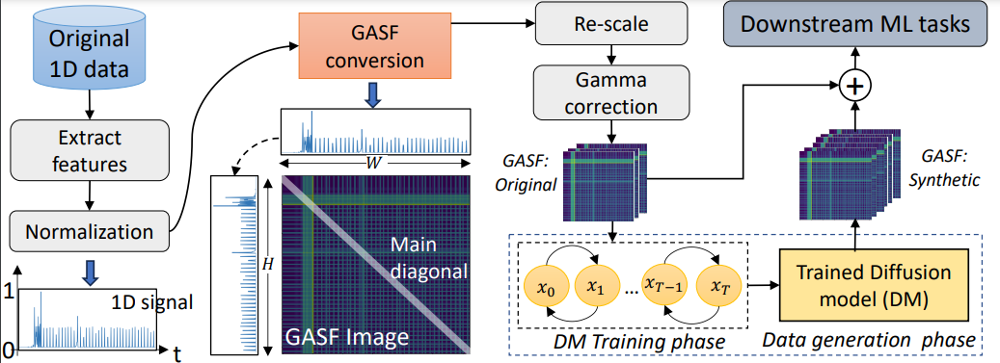

# NetDiffus
This is repository of the paper [NetDiffus: Network Traffic Generation by Diffusion Models through Time-Series Imaging](https://arxiv.org/abs/2310.04429) .

# Requirements

- Python 3.9
- guided-diffusion
- torch
- tqdm
- blobfile>=1.0.5

# About NetDiffus

While Machine-Learning based network data analytics are now common-
place for many networking solutions, nonetheless, limited access to appropriate
networking data has been an enduring challenge for many networking problems.
Causes for lack of such data include complexity of data gathering, commercial
sensitivity, as well as privacy and regulatory constraints. To overcome these
challenges, we present a Diffusion-Model (DM) based end-to-end framework,
NetDiffus, for synthetic network traffic generation which is one of the emerg-
ing topics in networking and computing system. NetDiffus first converts one-
dimensional time-series network traffic into two-dimensional images, and then
synthesizes representative images for the original data. We demonstrate that
NetDiffus outperforms the state-of-the-art traffic generation methods based on
Generative Adversarial Networks (GANs) by providing 66.4% increase in the
fidelity of the generated data and an 18.1% increase in downstream machine
learning tasks. We evaluate NetDiffus on seven diverse traffic traces and show
that utilizing synthetic data significantly improves several downstream ML tasks
including traffic fingerprinting, anomaly detection and traffic classification.



We have released the data for the purpose of re-implementing and testing the algoirhtm [here](https://drive.google.com/drive/folders/1qoNrghez1vffgApGe9SnUXSzV9fx6unz?usp=sharing). This dataset is not the complete one. Complete dataset will be available upon the request.


    Data structure for data generationn is as follows:
    - Youtube
        -vid1
            -vid1_1.png
            -vid1_2.png
            - ...
        -vid2
            - ...
        - ...

# Run Scripts

To start the training process you can run the following command:

```commandline
 python scripts/image_train.py --data_dir <dataset_path> --image_size 128 --num_channels 128 --num_res_blocks 3 --diffusion_steps 1000 --noise_schedule cosine --learn_sigma True --class_cond True --rescale_learned_sigmas False --rescale_timesteps False --lr 1e-4 --batch_size 4
```

To generate the data you can run the following command:

```commandline
  python scripts/image_sample.py --model_path <trained_model_path> --image_size 128 --num_channels 128 --num_res_blocks 3 --diffusion_steps 1000 --noise_schedule cosine --learn_sigma True --class_cond True --rescale_learned_sigmas False --rescale_timesteps False
```

You can run the classifier.py to get the classification results.

# Acknowledgements
This code is developed on the OpenAI's [Guided Diffusion](https://github.com/openai/guided-diffusion).
